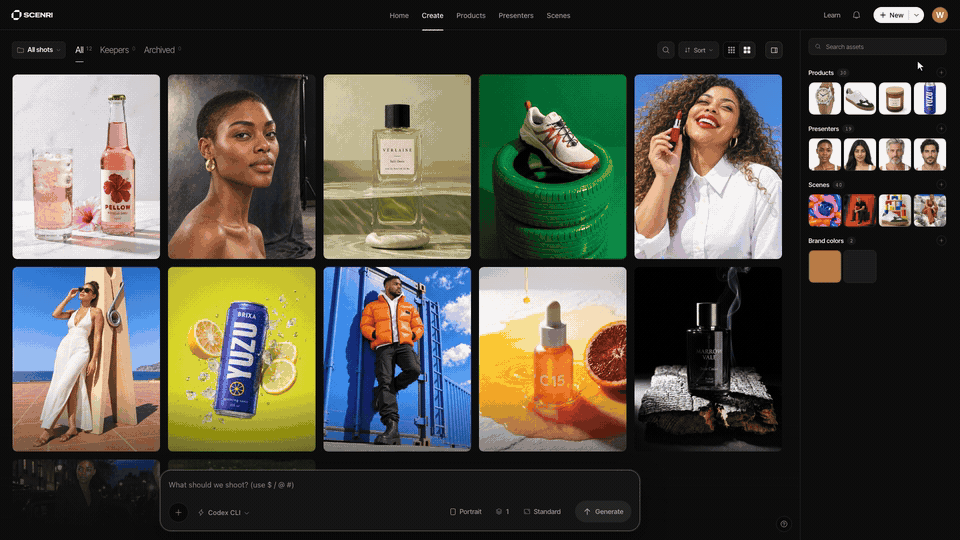

<div align="center">

# scenri

**The open studio for brand-consistent AI visuals.**

Define a client's brand once. Then generate, branch, and art-direct on-brand images through a version tree, running entirely on your own machine and your own AI accounts.

[](https://github.com/tonygorb/scenri/actions/workflows/ci.yml)
[](https://www.npmjs.com/package/scenri)
[](LICENSE)

```bash
npx scenri
```

<!-- BEFORE LAUNCH: record a 10 to 15 second loop showing generate, branch an
     edit, compare the drift, keep the winner. Save to docs/media/demo.gif,
     then uncomment the img below. This is the single highest-leverage asset
     on the page, so it stays commented out rather than rendering broken. -->

<!--  -->

</div>

---

## What it is

Most AI image tools give you a prompt box and a slot machine. scenri gives you the part that actually takes the time: **art direction**.

Every shot is a node in a tree. Branch an edit from any node, put the two side by side, and a drift-diff shows you exactly where the model changed your product when it should not have.

It runs as a local server on `127.0.0.1`. Your brands, your images, and your keys stay on your disk.

## Run it

```bash
npx scenri
```

That is the whole install. It opens `http://127.0.0.1:4747`.

Generation runs on **Codex CLI**, an official helper from OpenAI that draws on your own ChatGPT plan. No API key to paste, and scenri never charges you. Each image draws on your plan's Codex usage. You do not have to set it up by hand: if it is missing, scenri offers to install it and to sign you in, both from the app. No ChatGPT plan? Add your own key from an image provider in Settings instead — see [Engines](#engines).

Requires **Node 20 or newer**. Two dependencies (`better-sqlite3` and `sharp`) ship native binaries, so on recent npm you may be asked to approve their install scripts once.

<details>
<summary>Run from source</summary>

```bash
git clone https://github.com/tonygorb/scenri.git
cd scenri
pnpm install
pnpm build        # builds the studio UI, required before the first run
pnpm dev          # starts the server on 127.0.0.1:4747
```

</details>

## First five minutes

1. **Paste a website URL.** scenri reads the public page and drafts the kit: name, palette, logo, tone.
2. **Describe a shot.** `@` pulls in a product or a person, `#` picks a look. The composer compiles a brief you can inspect before it runs.
3. **Generate on Codex CLI.** Runs on your own ChatGPT plan — no key, no per-image cost.
4. **Branch an edit** from any shot, then hit compare. The heatmap shows what moved.
5. **Add a real engine** in Settings when you want output you can ship.

## Why it is built this way

- **Iteration is the product.** A version tree, not a prompt box. Branch, compare, keep the winners.
- **Your brands are files, not hostages.** `.brand` is an open, documented format under a permissive license. Email one to a client. Any tool can adopt it.
- **Your AI, your cost.** Bring your own Codex CLI session or an API key. Experiments cost raw API price, or nothing at all on a local session. No credits that burn on a miss.
- **Local first, and it means it.** No account, no telemetry, no upload. The server binds to your machine only. The one request scenri makes on its own behalf is a daily version-number check against npm so updates can announce themselves — nothing about you or your work is sent, and it turns off in Settings or with `SCENRI_NO_UPDATE_CHECK=1` ([how updates work](docs/updates.md)).
- **Text you can still edit.** Headlines land as real layers on the image, not baked pixels. Restyle and re-export without regenerating.

## Engines

| Engine | What it costs you | Needs | Carries a Product or Presenter |
|---|---|---|---|
| **Codex CLI** | your ChatGPT plan | a ChatGPT account; the app installs and signs in for you | yes, up to 6 references |
| OpenRouter | about $0.04 a generation | API key | yes, up to 4 references |
| Replicate | about $0.003 a generation | API token | no |
| fal | about $0.003 a generation | API key | no |

Codex CLI is the default because it needs no key and because it carries the most reference images: a shot that has to keep both a product and a person accurate needs the room.

It is not free. Every ChatGPT plan comes with some Codex usage and each image spends a little of it. OpenAI meters that, not scenri, so spend caps do not apply to this engine.

**Without a ChatGPT plan**, use your own provider key. OpenRouter is the one to pick if your shots name a Product or a Presenter — Replicate and fal take no reference images, so scenri refuses those briefs on them rather than generating something that only looks right.

Keys are stored in your local library folder, sent only to that provider, and never returned by the API. Set a monthly spend cap per engine in Settings.

Your Codex session is yours: scenri runs the official `codex` commands on your machine and never reads, copies or stores the credential. That is also why there is no hosted version of this — a plan is licensed to the person who pays for it, not to a service pooling it for other people.

## Configuration

| Variable | Default | What it does |
|---|---|---|
| `SCENRI_HOME` | `~/.scenri` | where brands, images, and keys live |
| `SCENRI_PORT` | `4747` | port |
| `SCENRI_HOST` | `127.0.0.1` | this machine only, see the note below |
| `SCENRI_NO_OPEN` | unset | set to `1` to skip opening a browser |
| `SCENRI_NO_UPDATE_CHECK` | unset | set to `1` to never ask npm for the latest version |
| `SCENRI_REGISTRY` | npmjs | registry for the update check and downloads (mirrors, forks, airgaps) |

`OPENROUTER_API_KEY`, `REPLICATE_API_TOKEN` and `FAL_KEY` are read from the environment as an alternative to entering them in Settings.

**Before you change `SCENRI_HOST`:** scenri has no accounts, so anyone who can reach the port can spend your API keys and delete your library. Setting `SCENRI_HOST=0.0.0.0` opens it to your local network so you can use it from a phone. That path prints a URL carrying a one-time access token, refuses every request without it, and rejects unfamiliar `Host` headers. Treat it as convenience on a network you trust, not as a security boundary.

## Layout

| Package | Purpose |
|---|---|
| `packages/cli` | the `scenri` command: local server, engine detection, browser open |
| `packages/brand-spec` | the `.brand` schema, validator, and URL auto-builder |
| `packages/core` | brands, projects, version tree, image store, cost ledger (SQLite) |
| `packages/catalog` | product catalog import: Shopify, WooCommerce, Webflow, generic |
| `packages/engines/*` | engine adapters: `codex`, `openrouter`, `replicate`, `fal`, `demo` |
| `apps/studio` | the React studio the CLI serves |

One package publishes to npm: **`scenri`**, the CLI, which bundles everything else. The rest are internal.

## Contributing

Start with [CONTRIBUTING.md](CONTRIBUTING.md). Engine adapters are the friendliest surface: one file, one interface, well covered by tests.

Looking for a first contribution? [docs/A11Y-BACKLOG.md](docs/A11Y-BACKLOG.md) lists real accessibility defects with exact file and line numbers.

Found a security problem? Please report it privately. See [SECURITY.md](SECURITY.md).

## Status

Early. The version is `0.x` and interfaces can still move. Everything documented above works today. [ROADMAP.md](ROADMAP.md) says what is next.

## License

The application is [AGPL-3.0-only](LICENSE). The `.brand` format, its schema, and its validator live in [packages/brand-spec](packages/brand-spec) under Apache-2.0, so any tool may implement or reuse them without taking on copyleft. Contributions require a [CLA](CLA.md).

---

Built in public by **Tony Gorb** · bytonygorb@gmail.com
